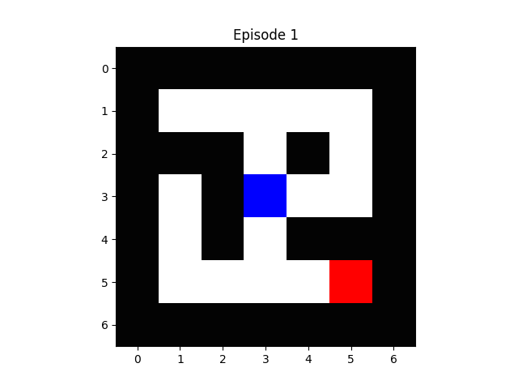


# Q-learning based Maze Solver
A maze solver application that makes use of the Q-learning algorithm

## Overview
This application/project was developed as a part of the graduate course "Intelligent Systems", which is part of the Intelligent Embedded Systems Master's degree program offered by Mälardalen University, Sweden.

  
 The learning process for varied initial points and dead-end detection

In addition to implementing the standard Q-learning algorithm, the application also allows for various configurations and heuristics, such as dead-end detection, greedy learning, and learning from fixed or varied initial points.

## Project Structure
- `src/`: A directory containing the main implementation of the Q-Learning algorithm for solving mazes, and a random maze generator
- `mazes/`: A directory where maze files are stored. Each maze file represents a different environment for testing the algorithm.
- `main.py`: Used for testing solutions on different mazes, demonstrating the functionality of the Q-Learning algorithm.
- `ProjectReport.pdf`: The project report

## Project done by
- [Benjamin Kraljušić](https://github.com/benjaminkraljusic)
- [Dženan Kreho](https://github.com/dkreho1)
- [Enesa Hrustić](https://github.com/EnesaHrustic)
